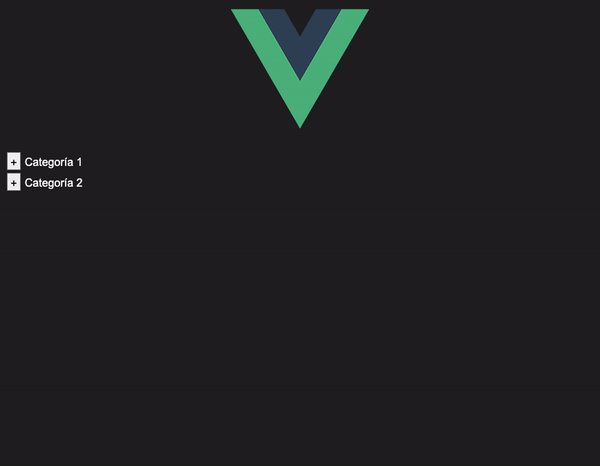

# Recursive Expandable Menu Vue



## Project setup

#### Clone the repository in your projects folder:
```
git clone https://github.com/Mathiew82/recursive-expandable-menu-vue.git
```

#### Install project dependencies:
```
yarn install
```

### Launch the application
```
yarn run serve
```
